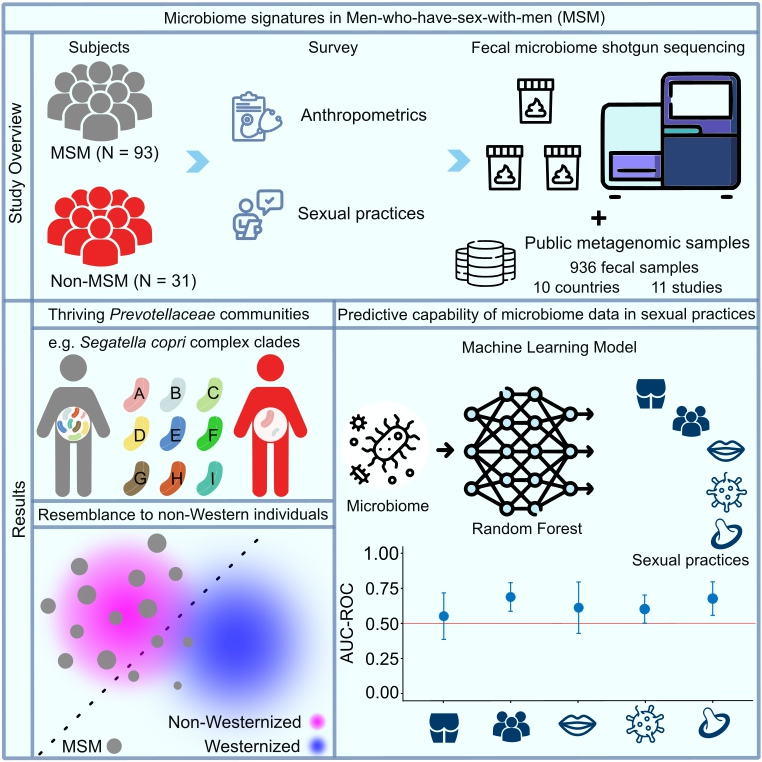

# KunDH-2024-CRM-MSM_metagenomics
Computational workflows for reproducing analysis in the study of Huang et al., 2024

#### Table of contents
1. [Setup](./docs/setup_general_usage.md)
2. [General usage](./docs/setup_general_usage.md)
3. Detailed tutorials
    * [Reads quality inspection with cumulative distribution function](./docs/cumulative_distribution_function.md)
    * [Alpha diversity analysis](./docs/alpha_diversity_analysis.md)
    * [Beta diversity analysis](./docs/beta_diversity_analysis.md)
    * [Co-presence analysis](./docs/copresence_analysis.md)
    * [ComplexHeatmap plotting](./docs/make_ComplexHeatmap.md)
    * [Make mosaic plot](./docs/make_mosaic_plot.md)
    * [Machine learning analysis](./docs/machine_learning_analysis.md)
    * [Deviation plot, UpSet plot, Lollipop plot](./docs/several_plots.md)

