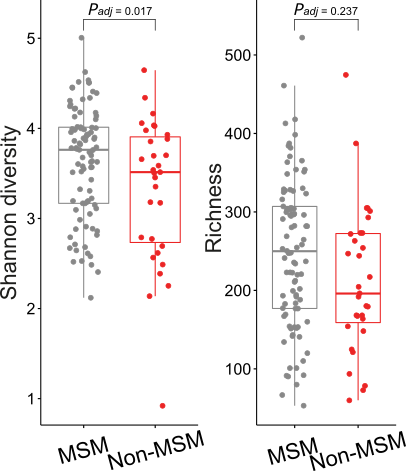

# Alpha Diversity Analysis
This tutorial is to use R-based functions to estimate shannon index and richness of microbiomes using metaphlan profiles. Estimates are further visualized and tested for statistical significance associating with metadata. 

#### R packages required
* [SummarizedExperiment](https://bioconductor.org/packages/release/bioc/html/SummarizedExperiment.html)
* [mia](https://www.bioconductor.org/packages/release/bioc/html/mia.html)
* [ggpubr](https://cran.r-project.org/web/packages/ggpubr/readme/README.html)
* [ggplot2](https://ggplot2.tidyverse.org/)
* [lfe](https://rdrr.io/cran/lfe/)

#### Alpha diversity estimation and visualization

Open a new working R script, and load our funtion-packed R script from which you can use relavant modules.

```{r}
>source(file = "path_to_the_package/KunDH-2023-CRM-MSM_metagenomics/scripts/functions/alpha_diversity_funcs.R")
```

Load a merged metaphlan profile which contains metadata and taxonomic abundances. Here, we are going to use an example file for demostration.

```{r}
>mpa_df <- data.frame(read.csv("path_to_the_package/KunDH-2023-CRM-MSM_metagenomics/example_data/>merged_abundance_table_species_sgb_md.tsv",
                      header = TRUE,
                      sep = "\t"))
```
|sample|P057|P054|P052|...|P049|
|----|----|----|---|---|---|
|sexual_orientation|MSM|MSM|MSM|...|Non-MSM|
|HIV_status|negative|positive|positive|...|negative|
|ethnicity|Caucasian|Caucasian|Caucasian|...|Caucasian|
|antibiotics_6month|Yes|No|No|...|No|
|BMI_kg_m2_WHO|ObeseClassI|Overweight|Normal|...|Overweight|
|Methanomassiliicoccales_archaeon|0.0|0.0|0.0|...|0.01322|
|...|...|...|...|...|...|
|Methanobrevibacter_smithii|0.0|0.0|0.0|...|0.19154|

Next, we convert the dataframe to [SummarizedExperiment](https://bioconductor.org/packages/release/bioc/html/SummarizedExperiment.html) data structure to continue the analysis using function `SE_converter` which needs to specify three arguments:
  * `md_rows`: a vector specifying the range of rows indicating metadata. Note: 1-based.
  * `tax_starting_row`: an interger corresponding to the row where taxonomic abundances start.
  * `mpa_md`: a metaphlan table wedged with metadata, in the form of dataframe.

```{r}
>SE <- SE_converter(md_rows = 1:5,
                   tax_starting_row = 6, 
                   mpa_md = mpa_df)
```
```{r}
>SE
class: SummarizedExperiment
dim: 1676 139
metadata(0):
assays(1): relative_abundance
rownames(1676): Methanomassiliicoccales_archaeon|t__SGB376
  GGB1567_SGB2154|t__SGB2154 ... Entamoeba_dispar|t__EUK46681
  Blastocystis_sp_subtype_1|t__EUK944036
rowData names(1): species
colnames(139): P057 P054 ... KHK16 KHK11
colData names(5): sexual_orientation HIV_status ethnicity
  antibiotics_6month BMI_kg_m2_WHO
```

Now, we can use function `est_alpha_diversity` to estimate shannon index and richness for each metagenomic sample.

```{r}
>alpha_df <- est_alpha_diversity(se_data = SE)
>alpha_df
```
||sexual_orientation|HIV_status|ethnicity|antibiotics_6month|BMI_kg_m2_WHO|observed|shannon|
|----|----|----|-----|------|-----|-----|-----|
|P057|MSM|negative|Caucasian|Yes|ObeseClassI|134|3.1847|
|P054|MSM|positive|Caucasian|No|Overweight|141|2.1197|
|...|...|...|...|...|...|...|...|
|P052|MSM|positive|Caucasian|No|Normal|152|2.5273|

To compare the difference of alpha diversities between groups, we can use function `make_boxplot` with arguments:
* `df`: The dataframe containing microbiome alpha diversities, e.g. `shannon` and `observed` with categorical metadata.
* `xlabel`: the column name one will put along x-axis.
* `ylabel`: the index estimate one will put along y-axis.
* `font_size`: the font size, default: [11]
* `jitter_width`: the jitter width, default: [0.2]
* `dot_size`: the dot size inside the boxplot, default: [1]
* `font_style`: the font style, default: `Arial`
* `pal`: a list of color codes for pallete, e.g. c(#888888, #eb2525). The order corresponds the column order of boxplot.
* `stats`: wilcox rank-sum test. default: `TRUE`
~
```{r}
>shannon <- make_boxplot(df = alpha_df,
                         xlabel = "sexual_orientation",
                         ylabel = "shannon",
                         stats = TRUE,
                         pal = c("#888888", "#eb2525"))
>richness <- make_boxplot(df = alpha_df,
                          xlabel = "sexual_orientation", 
                          ylabel = "observed",
                          stats = TRUE,
                          pal = c("#888888", "#eb2525"))
>multi_plot <- ggpubr::ggarrange(shannon, richness, ncol = 2)
>ggplot2::ggsave(file = "shannon_richness.svg", plot = multi_plot, width = 4, height = 5)
```


**Note:** The figure displayed above had been edited using [inkscape](https://inkscape.org/) on the base of the crude output in order to enhance the readability and aesthetic sense.

#### Association significance estimation by fixed effects linear model

It is common to deal with multiple variables (e.g. HIV infection and antibiotics use) in metagenomic analysis besides the variable of interest (e.g. sexual orientation). Therefore, it is important to control these confounding effects when we test the association between microbiome matrix (e.g. shannon or richness) and the variable of interest (e.g. sexual orientation). Here, we use function `felm_fixed` which is based on fixed effects linear model implemented in R package [lfe](https://rdrr.io/cran/lfe/) to estimate the association significance of microbiome with interesting variable, meanwhile controling the confounding effects from other variables.
* `data_frame`: The dataframe containing microbiome alpha diversities, e.g. `shannon` and `observed` with multiple variables.
* `f_factors`: A vector of variables representing fixed effects. 
* `t_factor`: The variable of interest for testing.
* `measure`: The header indicating microbiome measure, e.g. `shannon` or `richness`

```{r}
>lfe_stats <- felm_fixed(data_frame = alpha_df,
                         f_factors = c(c("HIV_status", "antibiotics_6month")),
                         t_factor = "sexual_orientation",
                         measure = "shannon")
>summary(lfe_stats)
Residuals:
    Min      1Q  Median      3Q     Max 
-2.3112 -0.4666  0.1412  0.5200  1.4137 

Coefficients:
                      Estimate Std. Error t value Pr(>|t|)    
(Intercept)            3.62027    0.70476   5.137 9.64e-07 ***
sexual_orientationMSM  0.29175    0.13733   2.125   0.0355 *  
HIV_statuspositive    -0.28400    0.14658  -1.937   0.0548 .  
antibiotics_6monthNo  -0.10405    0.67931  -0.153   0.8785    
antibiotics_6monthYes  0.01197    0.68483   0.017   0.9861    
---
Signif. codes:  0 ‘***’ 0.001 ‘**’ 0.01 ‘*’ 0.05 ‘.’ 0.1 ‘ ’ 1

Residual standard error: 0.6745 on 134 degrees of freedom
Multiple R-squared(full model): 0.07784   Adjusted R-squared: 0.05032 
Multiple R-squared(proj model): 0.07784   Adjusted R-squared: 0.05032 
F-statistic(full model):2.828 on 4 and 134 DF, p-value: 0.02725 
F-statistic(proj model): 2.828 on 4 and 134 DF, p-value: 0.02725
``` 