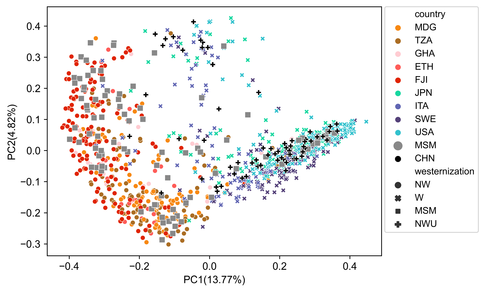

# Beta Diversity Analysis
This tutorial is to use R-based functions as well as Python scripts to estimate the beta diversity of microbiomes using metaphlan profiles.

## R-based method

#### R packages required

* [vegan](https://cran.r-project.org/web/packages/vegan/index.html)
* [ggplot2](https://ggplot2.tidyverse.org/)
* [ape](https://cran.r-project.org/web/packages/ape/index.html)
* [tidyverse](https://www.tidyverse.org/packages/)

#### Beta diversity analysis, visualization and significance assessment

Open a new working R script, and load our funtion-packed R script from which you can use relavant modules.

```{r}
>source(file = "path_to_the_package/KunDH-2023-CRM-MSM_metagenomics/scripts/functions/beta_diversity_funcs.R")
```

Load a [matrix table](../example_data/matrix_species_relab.tsv) of species relative abundances quantified by MetaPhlAn and a [metadata table](../example_data/metadata_of_matrix_species_relab.tsv) which matches the matrix table row by row, namely in both matrix table and metadata table each row indicates the sample sample.

```{r}
>matrix <- read.csv("path_to_the_package/KunDH-2023-CRM-MSM_metagenomics/example_data/matrix_species_relab.tsv",
                    header = TRUE,
                    sep = "\t")
>metadata <- read.csv("path_to_the_package/KunDH-2023-CRM-MSM_metagenomics/example_data/metadata_of_matrix_species_relab.tsv",
                    header = TRUE,
                    sep = "\t")
```

Now, you would like to test the significance of the sample segragating due to the variable of interest while adjusting covariables such as BMI and disease status, etc. Here, we use function `est_permanova` which implements [PERMANOVA](https://rdrr.io/rforge/vegan/man/adonis.html) analysis, specifying arguments:
  * `mat`: the loaded matrix from metaphlan-style table, [dataframe].
  * `md`: the metadata table pairing with the matrix, [dataframe].
  * `variable`: specify the variable for testing, [string].
  * `covariables`: give a vector of covariables for adjustment, [vector].
  * `nper`: the number of permutation, [int], default: [999].
  * `to_rm`: a vector of values in "variable" column where the corresponding rows will be removed first.
  * `by_method`: "terms" will assess significance for each term, sequentially; "margin" will assess the marginal effects of the terms.

Here, we show an example by testing variable *condom use* while adjusting covariables including *antibiotics use*, *HIV status*, *BMI*, *Diet* and *Inflamatory bowel diseases* which might play a role in explaining the inter-individual variation in the gut microbiome composition.

```{r}
>est_permanova(mat = matrix, 
              md = metadata, 
              variable = "condom_use", 
              covariables = c("Antibiotics_6mo", "HIV_status", "inflammatory_bowel_disease", "BMI_kg_m2_WHO", "diet"),
              nper = 999, 
              to_rm = c("no_receptive_anal_intercourse"),
              by_method = "margin")

                           Df SumOfSqs      R2      F Pr(>F)   
condom_use                  4   1.2161 0.08194 1.5789  0.008 **
Antibiotics_6mo             2   0.4869 0.03281 1.2643  0.160   
HIV_status                  1   0.3686 0.02484 1.9146  0.030 * 
inflammatory_bowel_disease  1   0.2990 0.02015 1.5529  0.066 . 
BMI_kg_m2_WHO               5   1.8376 0.12382 1.9087  0.002 **
diet                        3   0.8579 0.05781 1.4853  0.036 * 
Residual                   49   9.4347 0.63571                 
Total                      65  14.8412 1.00000                 
---
Signif. codes:  0 ‘***’ 0.001 ‘**’ 0.01 ‘*’ 0.05 ‘.’ 0.1 ‘ ’ 1
```

Next, to visualize the sample segragation based on microbiome beta diversity we can use function `plot_pcoa` function which needs input arguments:
  * `mat`: the loaded matrix from metaphlan-style table, [dataframe].
  * `md`: the metadata table pairing with the matrix, [dataframe].
  * `dist_method`: the method for calculating beta diversity, [string]. default: ["bray"]. For other methods, refer to [vegdist()](https://rdrr.io/cran/vegan/man/vegdist.html). 
  * `fsize`: the font size of labels, [int]. default: [11]
  * `dsize`: the dot size of scatter plot, [int]. default: [3]
  * `fstyle`: the font style, [string]. default: ["Arial"]
  * `variable`: specify the variable name based on which to group samples, [string].
  * `to_rm`: a vector of values in "variable" column where the corresponding rows will be excluded first before analysis.

Below, we are showcasing how to inspect the beta diversity of microbiomes from the angle of five different variables.

```{r}
>pcoa_condom_use <- pcoa_plot(mat = matrix,
                             md = metadata,
                             dist_method = "bray",
                             fsize = 11,
                             dsize = 3,
                             fstyle = "Arial",
                             variable = "condom_use",
                             to_rm = c("no_receptive_anal_intercourse"))
>pcoa_STI <- pcoa_plot(mat = matrix,
                             md = metadata,
                             dist_method = "bray",
                             fsize = 11,
                             dsize = 3,
                             fstyle = "Arial",
                             variable = "STI")
>pcoa_number_of_partners <- pcoa_plot(mat = matrix,
                             md = metadata,
                             dist_method = "bray",
                             fsize = 11,
                             dsize = 3,
                             fstyle = "Arial",
                             variable = "number_partners")
>pcoa_rai <- pcoa_plot(mat = matrix,
                             md = metadata,
                             dist_method = "bray",
                             fsize = 11,
                             dsize = 3,
                             fstyle = "Arial",
                             variable = "receptive_anal_intercourse")
>pcoa_oral_sex <- pcoa_plot(mat = matrix,
                             md = metadata,
                             dist_method = "bray",
                             fsize = 11,
                             dsize = 3,
                             fstyle = "Arial",
                             variable = "oral.sex")
>pcoa_lubricant_use <- pcoa_plot(mat = matrix,
                             md = metadata,
                             dist_method = "bray",
                             fsize = 11,
                             dsize = 3,
                             fstyle = "Arial",
                             variable = "lubricant")

>ggarrange(pcoa_rai, pcoa_lubricant_use, pcoa_STI,
           pcoa_oral_sex, pcoa_number_of_partners, pcoa_condom_use,
           nrow = 2, ncol = 3) 
```


## Python-based method

#### R packages required
* [scikit-bio >= 0.5.6](https://scikit.bio/)
* [pandas >= 1.3.5](https://pandas.pydata.org/)
* [numpy >= 1.23.5](https://numpy.org/)
* [matplotlib >= 3.5.0](https://matplotlib.org/)
* [seaborn >= 0.11.2](https://seaborn.pydata.org/)

#### Beta diversity analysis with PCoA plotting integrating maximum three variables
Here, we introduce a python script `multi_variable_pcoa_plot.py` in the `path_to_the_package/KunDH-2023-CRM-MSM_metagenomics/scripts` to perform PCoA analysis:

```{python}
usage: multi_variable_pcoa_plot.py [-h] [--abundance_table [ABUNDANCE_TABLE]] [--metadata [METADATA]] [--transformation [TRANSFORMATION]] [--metric [METRIC]] [--amplifier [AMPLIFIER]] [--sample_column [SAMPLE_COLUMN]] [--variable1 [VARIABLE1]] [--variable2 [VARIABLE2]] [--variable3 [VARIABLE3]]
                                   [--marker_palette [MARKER_PALETTE]] [--marker_shapes [MARKER_SHAPES]] [--marker_sizes [MARKER_SIZES]] [--output_figure [OUTPUT_FIGURE]] [--test [TEST]] [--df_opt [DF_OPT]] [--font_style [FONT_STYLE]] [--font_size [FONT_SIZE]]

This program is to do PCoA analysis on microbial taxonomic or functional abundance data integrating maximum three variables together.

optional arguments:
  -h, --help            show this help message and exit
  --abundance_table [ABUNDANCE_TABLE]
                        Input the merged abundance table generated by MetaPhlAn.
  --metadata [METADATA]
                        Input a tab-delimited metadata file.
  --transformation [TRANSFORMATION]
                        Specify the tranformation function applied on data points in the original table. For abundance table, you can choose <sqrt>/<log>. Default setting is <None>.
  --metric [METRIC]     Specify the metric you want to use for calculating beta diversity in the case of as input using abundance table.<braycurtis>/<unweighted_unifrac>/<jaccard>/<weighted_unifrac>. Default setting is <braycurtis>
  --amplifier [AMPLIFIER]
                        Specify how much you want to amplify your original data point. For example, <--amplifier 100> indicates that all original data point times 100. Default is 1.
  --sample_column [SAMPLE_COLUMN]
                        Specify the header of column containing metagenome sample names in the metadata file.
  --variable1 [VARIABLE1]
                        Specify the header of the variable in the metadata table you want to assess. This variable will be represented by colors.
  --variable2 [VARIABLE2]
                        Specify the header of second variable in the metadata table you want to assess. This variable will be represented by marker shapes.
  --variable3 [VARIABLE3]
                        Specify the header of the third variable in the metadata table you want to assess. This variable will be represented by marker sizes.
  --marker_palette [MARKER_PALETTE]
                        Input a tab-delimited mapping file where 1st column contains group names and 2nd column contains color codes. default: [None] (automatic handling)
  --marker_shapes [MARKER_SHAPES]
                        Input a tab-delimited mapping file where 1st column contains group names and 2nd column contains marker shapes. default: [None] (automatic handling)
  --marker_sizes [MARKER_SIZES]
                        Input a tab-delimited mapping file where values are group names and keys are marker size. default: [None] (automatic handling)
  --output_figure [OUTPUT_FIGURE]
                        Specify the name for the output figure. For example, output_figure.svg
  --test [TEST]         Specify an output file for saving permanova test results. For example, project_name
  --df_opt [DF_OPT]     Specify the output name for saving coordinates (PC1 and PC2) for each sample. For example, project_name_coordinates.tsv
  --font_style [FONT_STYLE]
                        Specify the font style which is composed by font family and font type, delimited with a comma. default: [sans-serif,Arial]
  --font_size [FONT_SIZE]
                        Specify the font size. default: [11]

examples:
pcoa_painter.py --abundance_table <merged_metaphlan_table> --metadata <metadata> --sample_column <sample_header> --variable1 <variable1_name> --variable2 <variable2_name> --variable3 <variable3_name> --output_figure <output.png>
```

To demostrate the usage of `multi_variable_pcoa_plot.py`, we will drawa PCoA plot based on [microbiome compistion of samples](../example_data/mvpp_mpa_species_relab.tsv.bz2) from 11 populations grouped as *W (Westernization)*, *NW (Non-Westernization)*, *NWU (Non-Westernization(Urban))* and *MSM (Men-having-sex-with-men)*. Different populations will be assigned with custom colors using a [color map file](../example_data/mvpp_color_map.tsv) and *MSM* population will be highlighted with larger marker size using a [marker size map file](../example_data/mvpp_marker_size_map.tsv). The metadata of each sample is provided by a [metadata file](../example_data/mvpp_metadata.tsv).

Example command:
~~~
$multi_variable_pcoa_plot.py --abundance_table mvpp_mpa_species_relab.tsv --metadata mvpp_metadata.tsv --sample_column sample --variable1 country --variable2 westernization --variable3 country --output_figure mvpp_pcoa.png --test mvpp_permanova.tsv --df_opt mvpp_coordinates_df.tsv --marker_palette mvpp_color_map.tsv --marker_sizes mvpp_marker_size_map.tsv
~~~



As optional ouputs, `get_palette(palette = "default", k)` also generates non-adjustment PERMANOVA test (e.g. [mvpp_permanova.tsv](../example_data/mvpp_permanova.tsv)) and coordinates of PC1 and PC2 (e.g. [mvpp_coordinates.tsv](../example_data/mvpp_coordinates.tsv)) which can be used in visualization in other ways we will discuss shortly below.

## A method mixing R and Python

If you wish to enhance the aesthecity of PCoA plot using R but with the pre-calculated coordinates from [multi_variable_pcoa_plot.py](../scripts/multi_variable_pcoa_plot.py) with the flag `--df_opt`, you are suggested to use our R function `pcoa_sideplot()` on coordinate table from `multi_variable_pcoa_plot.py` with arguments:
  * `coordinate_df`: the coordinate table generated from python script multi_variable_pcoa_plot.py --df_opt, for example [coordinate_table.tsv](../example_data/coordinate_table.tsv). 
  * `variable`: specify the variable you want to inspect on PCoA.
  * `color_palettes`: give a named vector to pair color palettes with variable group names. default: [ggpubr default palette]
  * `coordinate_1`: specify the column header of the 1st coordinate. default: [*PC1*]
  * `coordinate_2`: specify the column header of the 2nd coordinate. default: [*PC2*]
  * `marker_size`: specify the marker size of the PCoA plot. default: [3]
  * `font_size`: specify the font size of PCoA labels and tick labels. default: [20]
  * `font_style`: specify the font style of PCoA labels and tick labels. default: [*Arial*]

  For example:

  ```{r}
  >source(file = "path_to_the_package/KunDH-2023-CRM-MSM_metagenomics/scripts/functions/beta_diversity_funcs.R")
  >coordinate_df <- data.frame(read.csv("path_to_the_package/KunDH-2023-CRM-MSM_metagenomics/example_data/coordinate_table.tsv",
                               header = TRUE,
                               sep = "\t"))
  >pcoa_sideplot(coordinate_df = coordinate,
                coordinate_1 = "PC1",
                coordinate_2 = "PC2",
                variable = "sexual_orientation",
                color_palettes = c("Non-MSM" = "#888888", "MSM" = "#eb2525"))
  ```

[PCoA Side plot](../images/pcoa_w_sideplot.png)

**Note:** The figure displayed above had been edited using [inkscape](https://inkscape.org/) on the base of the crude output in order to enhance the readability and aesthetic sense.