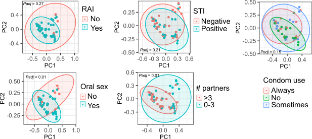

# Beta Diversity Analysis
This tutorial is to use R-based functions as well as Python scripts to estimate the beta diversity of microbiomes using metaphlan profiles.

## R-based method

#### R packages required

* [vegan](https://cran.r-project.org/web/packages/vegan/index.html)
* [ggplot2](https://ggplot2.tidyverse.org/)
* [ape](https://cran.r-project.org/web/packages/ape/index.html)
* [tidyverse](https://www.tidyverse.org/packages/)

#### Beta diversity analysis, visualization and significance assessment

Open a new working R script, and load our funtion-packed R script from which you can use relavant modules.

```{r}
>source(file = "path_to_the_package/KunDH-2023-CRM-MSM_metagenomics/scripts/functions/beta_diversity_funcs.R")
```

Load a [matrix table](../example_data/matrix_species_relab.tsv) of species relative abundances quantified by MetaPhlAn and a [metadata table](../example_data/metadata_of_matrix_species_relab.tsv) which matches the matrix table row by row, namely in both matrix table and metadata table each row indicates the sample sample.

```{r}
>matrix <- read.csv("path_to_the_package/KunDH-2023-CRM-MSM_metagenomics/example_data/matrix_species_relab.tsv",
                    header = TRUE,
                    sep = "\t")
>metadata <- read.csv("path_to_the_package/KunDH-2023-CRM-MSM_metagenomics/example_data/metadata_of_matrix_species_relab.tsv",
                    header = TRUE,
                    sep = "\t")
```

Now, you would like to test the significance of the sample segragating due to the variable of interest while adjusting covariables such as BMI and disease status, etc. Here, we use function `est_permanova` which implements [PERMANOVA](https://rdrr.io/rforge/vegan/man/adonis.html) analysis, specifying arguments:
  * `mat`: the loaded matrix from metaphlan-style table, [dataframe].
  * `md`: the metadata table pairing with the matrix, [dataframe].
  * `variable`: specify the variable for testing, [string].
  * `covariables`: give a vector of covariables for adjustment, [vector].
  * `nper`: the number of permutation, [int], default: [999].
  * `to_rm`: a vector of values in "variable" column where the corresponding rows will be removed first.
  * `by_method`: "terms" will assess significance for each term, sequentially; "margin" will assess the marginal effects of the terms.

Here, we show an example by testing variable *condom use* while adjusting covariables including *antibiotics use*, *HIV status*, *BMI*, *Diet* and *Inflamatory bowel diseases* which might play a role in explaining the inter-individual variation in the gut microbiome composition.

```{r}
>est_permanova(mat = matrix, 
              md = metadata, 
              variable = "condom_use", 
              covariables = c("Antibiotics_6mo", "HIV_status", "inflammatory_bowel_disease", "BMI_kg_m2_WHO", "diet"),
              nper = 999, 
              to_rm = c("no_receptive_anal_intercourse"),
              by_method = "margin")

                           Df SumOfSqs      R2      F Pr(>F)   
condom_use                  4   1.2161 0.08194 1.5789  0.008 **
Antibiotics_6mo             2   0.4869 0.03281 1.2643  0.160   
HIV_status                  1   0.3686 0.02484 1.9146  0.030 * 
inflammatory_bowel_disease  1   0.2990 0.02015 1.5529  0.066 . 
BMI_kg_m2_WHO               5   1.8376 0.12382 1.9087  0.002 **
diet                        3   0.8579 0.05781 1.4853  0.036 * 
Residual                   49   9.4347 0.63571                 
Total                      65  14.8412 1.00000                 
---
Signif. codes:  0 ‘***’ 0.001 ‘**’ 0.01 ‘*’ 0.05 ‘.’ 0.1 ‘ ’ 1
```

Next, to visualize the sample segragation based on microbiome beta diversity we can use function `plot_pcoa` function which needs input arguments:
  * `mat`: the loaded matrix from metaphlan-style table, [dataframe].
  * `md`: the metadata table pairing with the matrix, [dataframe].
  * `dist_method`: the method for calculating beta diversity, [string]. default: ["bray"]. For other methods, refer to [vegdist()](https://rdrr.io/cran/vegan/man/vegdist.html). 
  * `fsize`: the font size of labels, [int]. default: [11]
  * `dsize`: the dot size of scatter plot, [int]. default: [3]
  * `fstyle`: the font style, [string]. default: ["Arial"]
  * `variable`: specify the variable name based on which to group samples, [string].
  * `to_rm`: a vector of values in "variable" column where the corresponding rows will be excluded first before analysis.

Below, we are showcasing how to inspect the beta diversity of microbiomes from the angle of five different variables.

```{r}
>pcoa_condom_use <- pcoa_plot(mat = matrix,
                             md = metadata,
                             dist_method = "bray",
                             fsize = 11,
                             dsize = 3,
                             fstyle = "Arial",
                             variable = "condom_use",
                             to_rm = c("no_receptive_anal_intercourse"))
>pcoa_STI <- pcoa_plot(mat = matrix,
                             md = metadata,
                             dist_method = "bray",
                             fsize = 11,
                             dsize = 3,
                             fstyle = "Arial",
                             variable = "STI")
>pcoa_number_of_partners <- pcoa_plot(mat = matrix,
                             md = metadata,
                             dist_method = "bray",
                             fsize = 11,
                             dsize = 3,
                             fstyle = "Arial",
                             variable = "number_partners")
>pcoa_rai <- pcoa_plot(mat = matrix,
                             md = metadata,
                             dist_method = "bray",
                             fsize = 11,
                             dsize = 3,
                             fstyle = "Arial",
                             variable = "receptive_anal_intercourse")
>pcoa_oral_sex <- pcoa_plot(mat = matrix,
                             md = metadata,
                             dist_method = "bray",
                             fsize = 11,
                             dsize = 3,
                             fstyle = "Arial",
                             variable = "oral.sex")
>pcoa_lubricant_use <- pcoa_plot(mat = matrix,
                             md = metadata,
                             dist_method = "bray",
                             fsize = 11,
                             dsize = 3,
                             fstyle = "Arial",
                             variable = "lubricant")

>ggarrange(pcoa_rai, pcoa_lubricant_use, pcoa_STI,
           pcoa_oral_sex, pcoa_number_of_partners, pcoa_condom_use,
           nrow = 2, ncol = 3) 
```



## Python-based method

## A method mixing R and Python