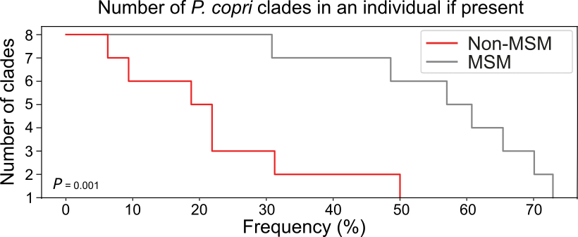

# Co-presence analysis
This tutorial is to use a python script to analyze co-presence pattern of multiple microorganism (i.e. strains, species, genus, etc).

#### Python packages required

* [pandas >= 1.3.5](https://pandas.pydata.org/)
* [matplotlib >= 3.5.0](https://matplotlib.org/)
* [seaborn >= 0.11.2](https://seaborn.pydata.org/)

#### Co-presence pattern analysis using `step_curve_drawer.py`

Here, we introduce a python script `step_curve_drawer.py` from `path_to_the_package/KunDH-2023-CRM-MSM_metagenomics/scripts` to draw co-presence patterns of multiple microorganism in different groups:

```{python}
usage: step_curve_drawer.py [-h] [--abundance_table [ABUNDANCE_TABLE]] [--variable [VARIABLE]] [--minimum_abundance [MINIMUM_ABUNDANCE]] [--species_number [SPECIES_NUMBER]] [--output [OUTPUT]]
                            [--palette [PALETTE]]

This program is to do draw step curves to analyze co-presense of multiple species in different groups.

optional arguments:
  -h, --help            show this help message and exit
  --abundance_table [ABUNDANCE_TABLE]
                        Input the MetaPhlAn4 abundance table which contains only a group of species one wants to analyze their co-presense state, with metadata being wedged.
  --variable [VARIABLE]
                        Specify the header of the variable in the metadata table you want to assess. For example, [Diet] variable columns has three categries - [vegan]/[Flexitarian]/[Omnivore].
  --minimum_abundance [MINIMUM_ABUNDANCE]
                        Specify the minimum abundance used for determining presense. note: [0, 100] and [0.0] by default
  --species_number [SPECIES_NUMBER]
                        Specify the total number of multiple species in the analysis.
  --output [OUTPUT]     Specify the output figure name.
  --palette [PALETTE]   Input a tab-delimited mapping file where values are group names and keys are color codes.

examples:step_curve_drawer.py --abundance_table <abundance_table_w_md.tsv> --variable <variable_name> --species_number <nr_sps> --output <output.svg>
```

To demonstrate the usage of `step_curve_drawer.py`, we will draw a co-presence pattern of eight *Segatella copri* clades (previously known as *Prevotella copri* clades) based on a [metaphlan relative abundance table specific to *Segatalla copri* clades](../example_data/mpa4_pcopri_abundances_md.tsv) from *MSM* and *Non-MSM* populations. *MSM* and *Non-MSM* samples will be assigned with custom colors using a [color map file](../example_data/copresence_color_map.tsv).

~~~bash
$ step_curve_drawer.py --abundance_table mpa_pcopri_abundances_md.tsv --variable sexual_orientation --species_number 8 --palette copresence_color_map.tsv --output copresence_plot.png
~~~

The output `copresence_plot.png` looks like:
 


**Note:** The figure displayed above had been edited using [inkscape](https://inkscape.org/) on the base of the crude output in order to enhance the readability and aesthetic sense.