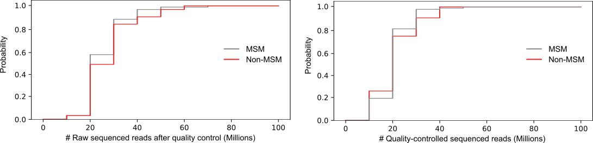

# Reads quality inspection with cumulative distribution function
This tutorial is to introduce how to use cumulative distribution function to inspect the quality of metagenomic sequencing reads, particularly to check if there is sequencing bias in samples from different groups.

### Python packages required
* [Python >= 3.9.0](https://www.python.org/)
* [scipy >= 1.8.1](https://scipy.org/)
* [pandas >= 1.3.5](https://pandas.pydata.org/)
* [numpy >= 1.23.5](https://numpy.org/)
* [seaborn >= 0.11.2](https://seaborn.pydata.org/)
* [matplotlib >= 3.5.0](https://matplotlib.org/)


#### Drawing cumulative distribution function for reads count
You will use a python script [cumulative_distribution_function.py](../scripts/cumulative_distribution_function.py) in the path `path_to_the_package/KunDH-2023-CRM-MSM_metagenomics/scripts/`, and a table containing the number of reads in each metagenomic sample like [example_reads_stats.tsv](../example_data/reads_stats_color_map.tsv) in the path `path_to_the_package/KunDH-2023-CRM-MSM_metagenomics/example_data/`. 

```{Python}
$ cumulative_distribution_function.py -h

usage: cumulative_distribution_function.py [-h] [--input_table [INPUT_TABLE]] [--output_figure [OUTPUT_FIGURE]] [--value_header [VALUE_HEADER]]
                                           [--variable_header [VARIABLE_HEADER]] [--palette_map [PALETTE_MAP]] [--font_style [FONT_STYLE]] [--font_size [FONT_SIZE]]

This program is to run draw cumulative curves.

optional arguments:
  -h, --help            show this help message and exit
  --input_table [INPUT_TABLE]
                        Input a table containing values you would like to draw cumulative function on.
  --output_figure [OUTPUT_FIGURE]
                        Specificy the output figure name.
  --value_header [VALUE_HEADER]
                        Specify the header name where values of interest are.
  --variable_header [VARIABLE_HEADER]
                        Specify the header name if these values are from different groups of a variable.
  --palette_map [PALETTE_MAP]
                        Give a palette map file where the first column is group names and second column is values.
  --font_style [FONT_STYLE]
                        Specify the font style. default: [Arial]
  --font_size [FONT_SIZE]
                        Specify the font size. default: [11]

examples: cumulative_distribution_function.py --input_table <input_table.tsv> --output_figure <output.svg> --value_header <value_header>
```

Example command 1:
```{bash}
$ cumulative_distribution_function.py --input_table example_reads_stats.tsv --output_figure nr_QC_reads_pairs.svg --value_header nr_QC_reads_pairs --palette_map reads_stats_color_map.tsv
```

Example command 2:
```{bash}
$ cumulative_distribution_function.py --input_table example_reads_stats.tsv --output_figure nr_raw_reads_pairs.svg --value_header nr_raw_reads_pairs --palette_map reads_stats_color_map.tsv
```
If you wish to assign specific colors to variable categories, for example, *gray* to *MSM* and *red* to *Non-MSM*, you can use a color palette map such as [reads_stats_color_map.tsv](../example_data/reads_stats_color_map.tsv) in the path `path_to_the_package/KunDH-2023-CRM-MSM_metagenomics/example_data/`.



**Note:** The figure displayed above had been edited and arranged using [inkscape](https://inkscape.org/) on the base of the crude output in order to enhance the readability and aesthetic sense.
