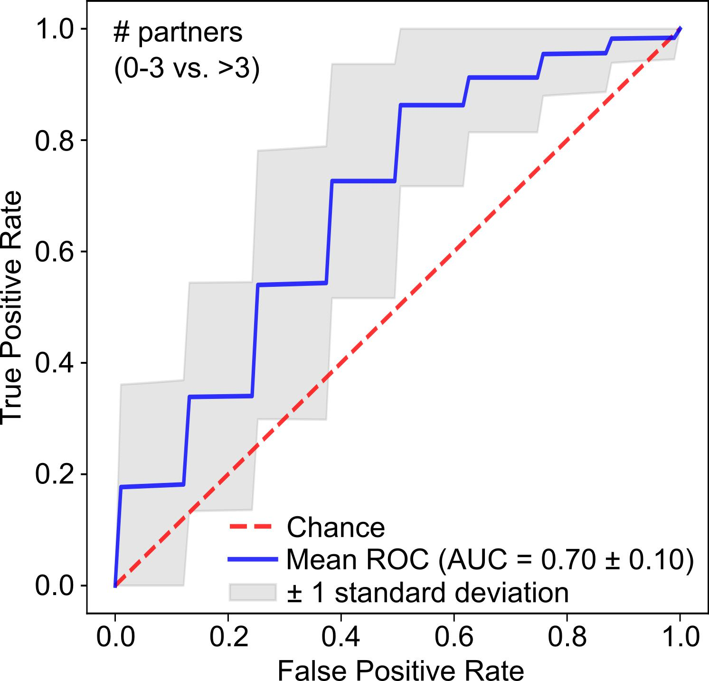
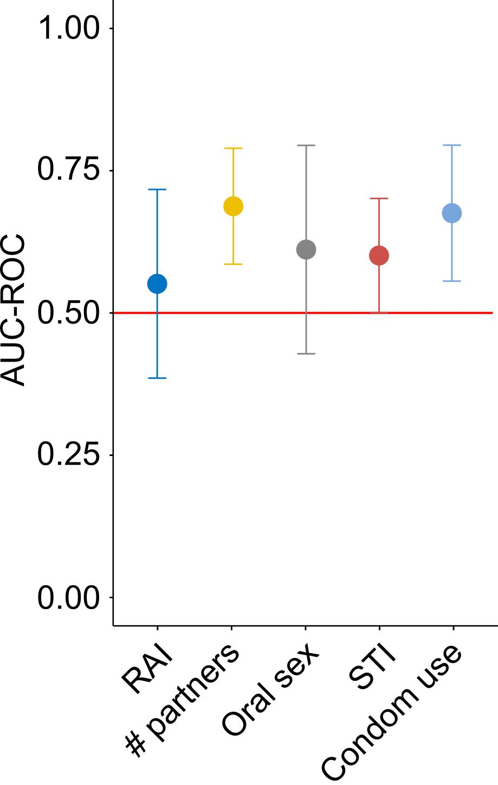

# Machine learning analysis
This tutorial is to use Random Forest model to evaluate the predictive capability of microbiome taxonomic composition.

## Evaluate the predictive power of microbiome taxonomic composition

#### Python package required

* [scikit-learn](https://scikit-learn.org/stable/)
* [Pandas](https://pandas.pydata.org/)
* [Matplotlib](https://matplotlib.org/)

#### Random forest training and results evaluation with ROC-AUC curve

Here, we would like to introduce a python script [evaluation_kfold.py](../scripts/evaluation_kfold.py) which implements [random forest model](https://en.wikipedia.org/wiki/Random_forest) to evaluate the predictive capability of information encoded in microbiome taxonomic composition for classifying different individuals.

```{python}
usage: evaluation_kfold.py [-h] [--mpa_df [MPA_DF]] [--md_rows [MD_ROWS]] [--target_row [TARGET_ROW]] [--pos_feature [POS_FEATURE]] [--neg_feature [NEG_FEATURE]] [--fold_number [FOLD_NUMBER]] [--repeat_time [REPEAT_TIME]] [--output [OUTPUT]]
                           [--output_values [OUTPUT_VALUES]] [--nproc [NPROC]] [--transform [TRANSFORM]]

This script is to estimate ROC AUC based on metaphlan-style table with metadata being inserted.

optional arguments:
  -h, --help            show this help message and exit
  --mpa_df [MPA_DF]     Input a mpa-style table with metadata being inserted.
  --md_rows [MD_ROWS]   Input row numbers for specifying metadata without considering header row, zero-based, comma delimited. for example, 0,1,2,3,4.
  --target_row [TARGET_ROW]
                        Specify the row number for indicating target metadata to examine, zero-based without considering header row.
  --pos_feature [POS_FEATURE]
                        Specify the feature name to be labeled as posive, e.g. 1.
  --neg_feature [NEG_FEATURE]
                        Specify the feature name to be labeld as negative, e.g. 0.
  --fold_number [FOLD_NUMBER]
                        Specify the fold number you want split the whole dataset.
  --repeat_time [REPEAT_TIME]
                        Specify the repeat time you want to split the dataset.
  --output [OUTPUT]     Specify the output figure name.
  --output_values [OUTPUT_VALUES]
                        Specify the output file name for storing ROC-AUC values.
  --nproc [NPROC]       Specify the number of processors you want to use. 4 by default.
  --transform [TRANSFORM]
                        Transform values in the matrix, [arcsin_sqrt] or [binary] or [None]. [None] by default

examples: evaluation_kfold.py --mpa_df <mpa_df.tsv> --md_rows 0,1,2,3,4 --target_row 3 --pos_feature <CRC> --neg_feature <Healthy> --fold_number 10 --repeat_time 20 --output ROC_AUC.svg  
```

To demostrate the tutorial, we use a microbiome dataset [machine_learning_input.tsv](../example_data/machine_learning_input.tsv) containing 52 subjects (28 subjects have >3 sexual partners and 24 sibjects have 0-3 sexual partners) and corresponding relative abundances of gut microbiome species.

Example command:
```{bash}
evaluation_kfold.py --mpa_df machine_learning_input.tsv --md_rows 0 --target_row 0 --pos_feature ">3" --neg_feature "0_3" --fold_number 3 --repeat_time 50 --output roc_auc_npartners.png --output_values roc_auc_npartners_values.tsv --nproc 10
```

It generates a ROC-AUC curve to show the overall predictive capability of random forest model fitting to our input microbiome taxonomic data.


Optionally, it can also generate the raw output [roc_auc_npartners_values.tsv](../example_data/roc_auc_npartners_values.tsv) used to generate the plot above. One can use it for other purposes.

**Note:** The figure displayed above had been edited using [inkscape](https://inkscape.org/) on the base of the crude output in order to enhance the readability and aesthetic sense.

## Visualize standard deviation of machine learning estimates

#### R packages required

* [ggplot2](https://ggplot2.tidyverse.org/)
* [ggpubr](https://rpkgs.datanovia.com/ggpubr/)

#### Plot the distribution of ROC-AUC estimates with standard deviation

We showcased above how to use ROC-AUC curve to evaluate the predictive capability of the microbiome by benchmarking with random effects. Here, we are going to introduce helper functions `data_summary` and `std_deviation_plot` implemented in [rocauc_stdv_funcs.R](../scripts/functions/rocauc_stdv_funcs.R) to visualize the standard deviations of ROC-AUC estimates for results from multiple Random Forest classifications.

`data_summary` is function to summarize raw ROC-AUC estimates in standard deviation with three arguments:
  * `data`: Input a dataframe as input.
  * `var_estimates`: The column header indicating ROC-AUC estimates for the target variable.
  * `groups`: The column header containing the group names.

`std_deviation_plot` is a function to plot ROC-AUC estimates with error bars based on standard deviation with arguments:
  * `df`: Input the dataframe of standard deviations of ROC-AUC estimates. 
  * `x_axis`: Specify the column header (groups usually) for X axis.
  * `y_axis`: Specify the column header (ROC-AUC means usually) for Y axis.
  * `stdv_column`: Specify the column header indicating standard deviation.
  * `palette`: Specify the palette for colors, default `[jco]`.
  * `y_label`: Name the Y label, default `[ROC-AUC]`.
  * `x_label`: Name the X laebl, default `NULL`.
  * `order_x_axis`: give a vector to specify the order of columns along X axis.
  * `font_size`: specify the font size, default `[11]`.
  * `font_family`: specify the font family, default `[Arial]`.

Here, we will use as demo data [merged ROC-AUC estimates](../example_data/roc_auc_merged.tsv) from performing Random Forest for classiying five sexual practices including *receptive anal intercourse*, *number of partners*, *oral sex*, *sex transmitted infection*, and *condom use*.

First, open a new working R script, and load our funtion-packed R script from which you can use relavant modules.

```{r}
>source(file = "path_to_the_package/KunDH-2023-CRM-MSM_metagenomics/scripts/functions/rocauc_stdv_diversity_funcs.R")
```

Second, load [merged ROC-AUC estimates](../example_data/roc_auc_merged.tsv) into a R dataframe.

```{r}
>roc_auc_merged <- data.frame(read.csv("path_to_the_package/KunDH-2023-CRM-MSM_metagenomics/example_data/roc_auc_merged.tsv", header = TRUE, sep = "\t"))
```

Third, make a data summary in standard deviations.

```{r}
>roc_auc_std <- data_summary(data = roc_auc_merged,
                            var_estimates = "roc.auc",
                            groups = "sexual.practice")
```

Finally, plot ROC-AUC estimates in standard deviation.

```{r}
>rocauc_plot <- std_deviation_plot(df = std,
                                  x_axis = "sexual.practice",
                                  y_axis = "roc.auc",
                                  stdv_column = "sd",
                                  order = c("Receptive anal intercourse", "Number of partners",
                                            "Oral sex", "Sex transmitted infection", "Condom use"))
```

Optionally, adjusting the plot with `ggplot2` (or `ggpubr`) functions, for example resetting y-axis limit and rotating x-axis labels.

```{r}
>rocauc_plot + ggplot2::ylim(0, 1) + ggpubr::rotate_x_text(45)
```

