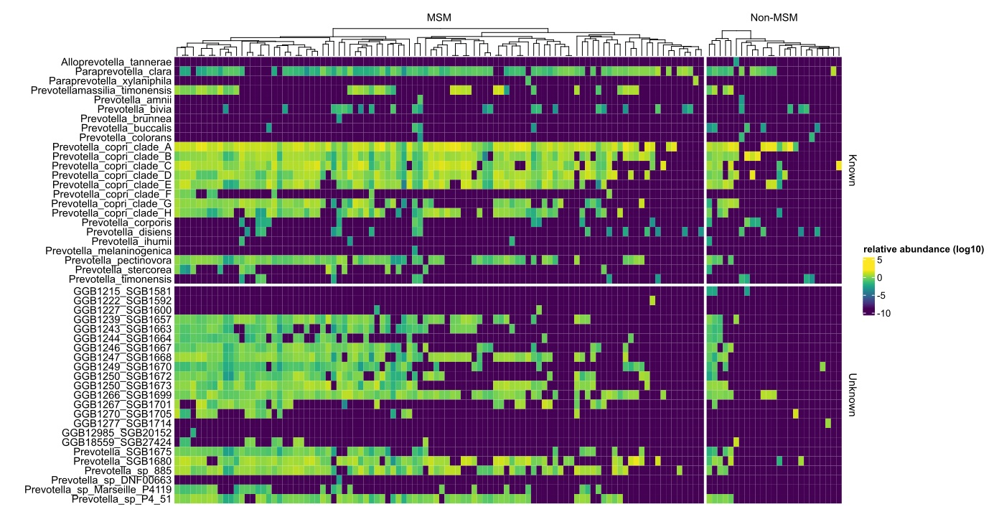
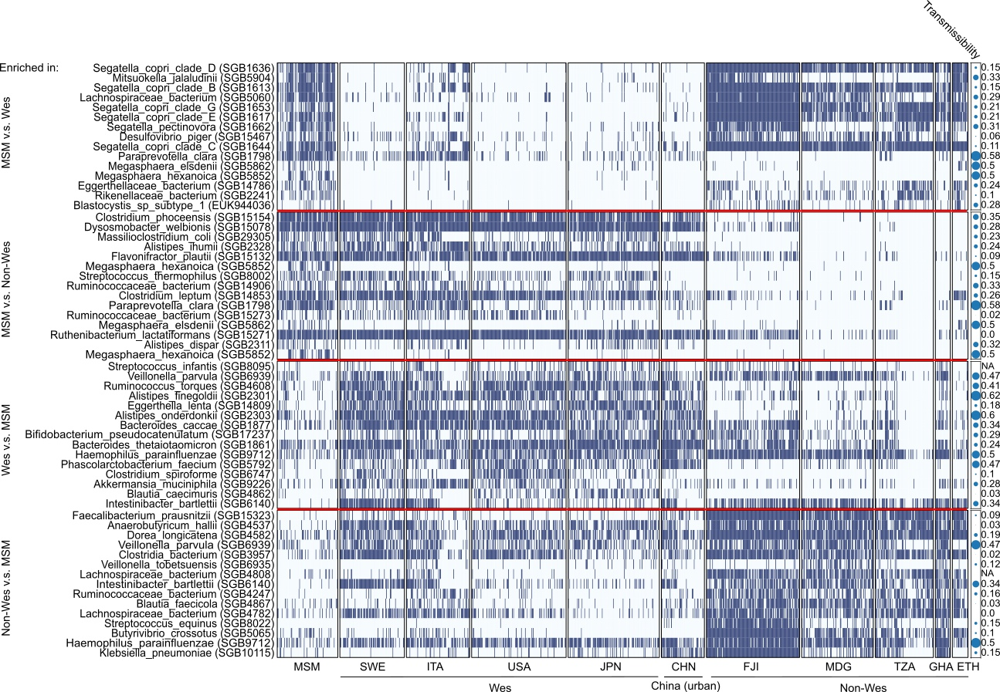

# ComplexHeatmap plotting
This tutorial is to use R-based functions to plot species abundances or prevalence on a complex heatmap. 

#### R packages required
* [ComplexHeatmap](https://bioconductor.org/packages/release/bioc/html/ComplexHeatmap.html)
* [grid](https://www.rdocumentation.org/packages/grid/versions/3.6.2)
#### R packages optional
* [viridis](https://cran.r-project.org/web/packages/viridis/index.html)
* [circlize](https://cran.r-project.org/web/packages/circlize/index.html)

#### Visualize species relative abundances (or presence/absence) by plotting ComplexHeatmap

Open a new working R script, and load our funtion-packed R script from which you can use relavant modules.

```{r}
>source(file = "path_to_the_package/KunDH-2023-CRM-MSM_metagenomics/scripts/functions/complexheatmap_plotting_funcs.R")
```

#####Example 1: Visualize *Prevotellaceae* community
Specify a [matrix table](../example_data/prevotellaceae_matrix_4ComplexHeatmap.tsv) of *Prevotellaceae* species relative abundances quantified by MetaPhlAn. Optionally, one can also provide a [row-grouping file](../example_data/prevotellaceae_matrix_4ComplexHeatmap_species_md.txt) which matches the matrix table row by row, and a [column-grouping file](../example_data/prevotellaceae_matrix_4ComplexHeatmap_sample_md.txt) which matches the matrix table column by column. 

```{r}
>prevotellaceae_mat <- "path_to_the_package/KunDH-2023-CRM-MSM_metagenomics/example_data/prevotellaceae_matrix_4ComplexHeatmap.tsv"
>prevotellaceae_row_groups <- "path_to_the_package/KunDH-2023-CRM-MSM_metagenomics/example_data/>prevotellaceae_matrix_4ComplexHeatmap_species_md.txt"
>prevotellaceae_col_groups <- "path_to_the_package/KunDH-2023-CRM-MSM_metagenomics/example_data/>prevotellaceae_matrix_4ComplexHeatmap_sample_md.txt"
```

Once input files were specified, now we can use a visualization function `plot_complex_heatmap` which implements [ComplexHeatmap](https://bioconductor.org/packages/release/bioc/html/ComplexHeatmap.html) to plot a heatmap attaching other information, by specifying arguments:
  * `mat_file`: the relative abundance file in metaphlan-style, [tsv file].
  * `column_md`: the column-grouping file in which each row matches the column of `mat_file`, [txt file].
  * `row_md`: the row-grouping file in which each row matches the row of `mat_file`, [txt file].
  * `color_bar_name`: the title for color bar scale, [string], default: [NULL].
  * `transformation`: the transformation function for values in `mat_file`, including log10([`log10`]), squared root arcsin ([`sqrt_asin`]) and binary([`binary`]), default: [NULL].
  * `font_style`: the font style for all labels in the plot, [string], default: ["Arial"].
  * `font_size`: the font size for all labels in the plot, [int], default: [11].
  * `show_col_names`: display column names, [TRUE/FALSE], default: [TRUE].
  * `show_row_names`: display row names, [TRUE/FALSE], default: [TRUE].
  * `row_names_side`: specify the side you would like to place row names, [string], default: [left].
  * `column_names_side`: specify the side you would like to place row names, [string], default: [bottom].
  * `cluster_columns`: cluster columns where values are similar, [TRUE/FALSE], default: [FALSE].
  * `cluster_rows`: cluster rows where values are similar, [TRUE/FALSE], default: [FALSE].
  * `cluster_row_slices`: reorder row-wise slices (you can call them batches too) where values of slices are similar, [TRUE/FALSE], default: [FALSE].
  * `cluster_column_slices`: reorder column-wise slices (you can call them batches too) where values of slices are similar, [TRUE/FALSE], default: [FALSE].
  * `color_func`: define custom color function to show values, default: [NULL].
  * `border`: add board to the plot, [TRUE/FALSE], default: [FALSE].
  * `row_gap`: control gap distance between row slices if you used `row_md` argument, [float], default: [1].
  * `column_gap`: control gap distance between column slices if you used `column_md` argument, [float], default: [1].
  * `width`: control the width of the whole complex heatmap, [float], default: [1].
  * `height`: control the height of the whole complex heatmap, [float], default: [1].

Here, we show an example by visualizing relative abundances of *Prevotellaceae* community in MSM and Non-MSM individuals.

```{r}
>col_func <- viridis::viridis(100) # define the color palette using viridis function.
>plot_complex_heatmap(prevotellaceae_mat,
                     color_bar_name = "relative abundance (log10)",
                     row_md = prevotellaceae_row_groups,
                     column_md = prevotellaceae_col_groups,
                     show_col_names = FALSE,
                     show_row_names = TRUE,
                     width = 3,
                     height = 5,
                     row_names_side = "left",
                     cluster_columns = TRUE,
                     cluster_column_slices = FALSE,
                     cluster_rows = FALSE,
                     cluster_row_slices = FALSE,
                     border = FALSE,
                     row_gap = 2,
                     column_gap = 2,
                     color_func = col_func,
                     transformation = "log10")
```



#####Example 2: Visualize presence and absence of a group of species across global populations

Now, we will use same strategy to visualize a panel of important species in terms of presence and absence in global populations. The [taxonomic matrix file](../example_data/global_enrichment_matrix.tsv) contains 60 species which were found enriched in MSM, Westernized or Non-Westernized individuals, and their groups can be found in [row-group file](../example_data/global_enrichment_matrix_rownames.tsv). Beside, ~1000 samples in the taxonomic matrix file came from MSM and 10 countries, and their groups can be found in [column-grouping file](../example_data/global_enrichment_matrix_colnames.tsv).

```{r}
global_mat <- "path_to_the_package/KunDH-2023-CRM-MSM_metagenomics/example_data/global_enrichment_matrix.tsv"
global_row_md <- "path_to_the_package/repos/KunDH-2023-CRM-MSM_metagenomics/example_data/global_enrichment_matrix_rownames.tsv"
global_col_md <- "path_to_the_package/repos/KunDH-2023-CRM-MSM_metagenomics/example_data/global_enrichment_matrix_colnames.tsv"

col_func <- circlize::colorRamp2(c(0, 1), hcl_palette = "Blues", reverse = T)
plot_complex_heatmap(global_mat,
                     row_md = global_row_md,
                     column_md = global_col_md,
                     show_col_names = F,
                     show_row_names = TRUE,
                     width = 0.3,
                     height = 3.5,
                     row_names_side = "left",
                     column_names_side = "top", 
                     cluster_columns = F,
                     cluster_column_slices = F,
                     cluster_rows = F,
                     cluster_row_slices = F,
                     border = T,
                     row_gap = 2,
                     column_gap = 2,
                     color_func = col_func,
                     transformation = "binary")
```

